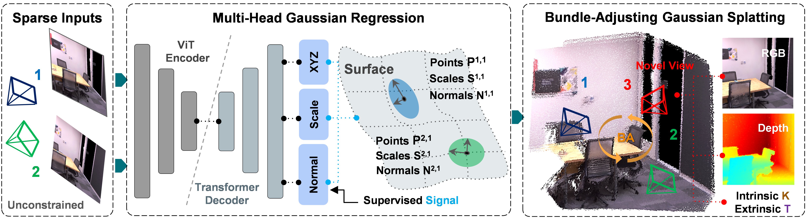

  <h2 align="center">SmileSplat: Generalizable Gaussian Splats for Unconstrained Sparse Images</h2>
 

    <a href="https://x"> Yanyan Li</a>
    ·
    <a href="https://x">Yixin Fang</a>
    ·
    <a href="https://x">Federico Tombari</a>
    ·
    <a href="https://x">Gim Hee Lee</a>
  

  <h4 align="center"> <a style="color: grey; pointer-events: none; text-decoration: none;">When I turn to <b>Dust</b>, you will see my <b>Smile</b> (待我成塵時，你將見我微笑) --- Lu Xun (魯迅)</a> </h4>
  <h3 align="center"><a href="https:x">Paper</a> | <a href="https://x">Project Page</a> | <a href="#" style="color: grey; pointer-events: none; text-decoration: none;">Code (Coming Soon)</a> </h3>
  

  

 
 

<!-- TABLE OF CONTENTS -->

  
Table of Contents

  <ol>
  <li>
    <a href="#Recults">Installation</a>
    </li>
    <li>
      <a href="#installation">Installation</a>
    </li>
    <li>
      <a href="#pre-trained-checkpoints">Pre-trained Checkpoints</a>
    </li>
    <li>
      <a href="#camera-conventions">Camera Conventions</a>
    </li>
    <li>
      <a href="#datasets">Public Datasets</a>
    </li>
    <li>
      <a href="#running-the-code">Running the Code</a>
    </li>
    <li>
      <a href="#acknowledgements">Acknowledgements</a>
    </li>
    <li>
      <a href="#citation">Citation</a>
    </li>
</ol>

## Results

### Comparison of novel view rendering on the public datasets

  

### Comparison of novel view rendering on the sparse-Replica sequences

  

## Installation

1. Clone NoPoSplat.

2. Create the environment, here we show an example using conda.

## Pre-trained Checkpoints

## Datasets

### Public datasets

### Sparse Replica
The Replica dataset is re-created by this paper, which can be download here. 

You also can build your own sparse-view dataset via the tool. 

## Running the Code
### Training

### Evaluation

#### Novel View Synthesis

#### Scaled Gaussian Radiance Field Visualization

#### Pose Estimation

## Acknowledgements

## Citation
